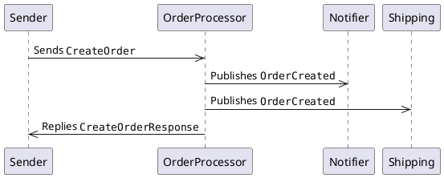
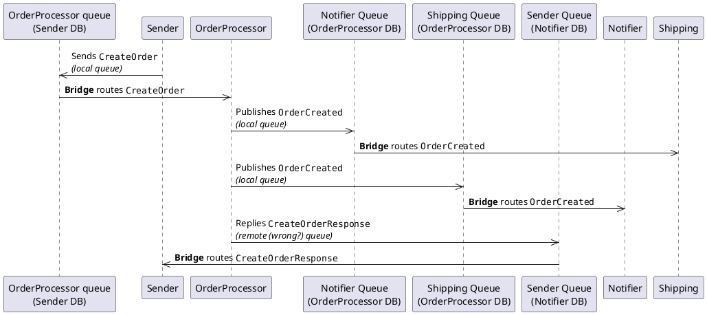

- When the bridge is configured, it is told which queue it should look at; then, it starts peeking messages from those queues, and move each message to its actual recipient.

  Basically, each database includes queues for all endpoints it interacts with (the bridge will create these queue, if required): an endpoint simply puts messages in the "correct" queue, but then the bridge will read that message, and move it to the final recipient, based on its (i.e. the bridge's) configuration.

  As a result of this approach, each database will have queues (tables) for all endpoints the bridge is aware of 

  For each endpoint, the bridge then knows which database it must connect to.

  > This is clearly a different approach from the router which, for the sender (or publisher), is **the** recipient (the sender does not know who the final recipient is).  

- `Sender` sends a command

  - A message is queued into `[nsb].[OrderProcessor]` in database `NsbBridgePlayground.Sender`
  
  ```json
  {
      "NServiceBus.MessageId": "151385fb-2048-4470-a5cb-b01a00b19677",
      "NServiceBus.MessageIntent": "Send",
      "NServiceBus.ConversationId": "cebf8ec4-53cf-4991-a78c-b01a00b19679",
      "NServiceBus.CorrelationId": "151385fb-2048-4470-a5cb-b01a00b19677",
      "NServiceBus.ReplyToAddress": "Sender@[nsb]@[NsbBridgePlayground.Sender]",
      "NServiceBus.OriginatingMachine": "UKSWL-1691759",
      "NServiceBus.OriginatingEndpoint": "Sender",
      "$.diagnostics.originating.hostid": "452e399ce344ab9e989b058579b3d026",
      "NServiceBus.ContentType": "text\/xml",
      "NServiceBus.EnclosedMessageTypes": "NsbBridgePlayground.Common.Messages.Commands.CreateOrder, NsbBridgePlayground.Common, Version=1.0.0.0, Culture=neutral, PublicKeyToken=null",
      "NServiceBus.Version": "7.8.2",
      "NServiceBus.TimeSent": "2023-06-07 10:46:34:654000 Z"
  }
  ```

  As expected
  
  - Column `ReplyToAddress` is set to `Sender@[nsb]@[NsbBridgePlayground.Sender]` 
  - Header `NServiceBus.ReplyToAddress` is set to `Sender@[nsb]@[NsbBridgePlayground.Sender]` 
  
- The bridge picks up the message, and forwards it to `OrderProcessor`

  - A message is queued into into `[nsb].[OrderProcessor]` in database `NsbBridgePlayground.OrderProcessor`
  
  ```json
  {
    "NServiceBus.MessageId": "151385fb-2048-4470-a5cb-b01a00b19677",
    "NServiceBus.MessageIntent": "Send",
    "NServiceBus.ConversationId": "cebf8ec4-53cf-4991-a78c-b01a00b19679",
    "NServiceBus.CorrelationId": "151385fb-2048-4470-a5cb-b01a00b19677",
    "NServiceBus.ReplyToAddress": "Sender@[nsb]@[NsbBridgePlayground.Shipping]",
    "NServiceBus.OriginatingMachine": "UKSWL-1691759",
    "NServiceBus.OriginatingEndpoint": "Sender",
    "$.diagnostics.originating.hostid": "452e399ce344ab9e989b058579b3d026",
    "NServiceBus.ContentType": "text\/xml",
    "NServiceBus.EnclosedMessageTypes": "NsbBridgePlayground.Common.Messages.Commands.CreateOrder, NsbBridgePlayground.Common, Version=1.0.0.0, Culture=neutral, PublicKeyToken=null",
    "NServiceBus.Version": "7.8.2",
    "NServiceBus.TimeSent": "2023-06-07 10:46:34:654000 Z",
    "NServiceBus.Bridge.Transfer": "ForSender->ForOrderProcessor"
  }
  ```
  
  We can notice a couple of things with respect to the moved message
  
  - Column `ReplyToAddress` is `NULL`
  - ⚠️ Surprisingly, header `NServiceBus.ReplyToAddress` is changed to `Sender@[nsb]@[NsbBridgePlayground.Shipping]`
  
    In general, the value this header is set to apparently depende on the last `BridgeEndpoint` we've set routing information for: after I swapped the code for `Notifier` and `Shipping`, `NServiceBus.ReplyToAddress` is then set to `Sender@[nsb]@[NsbBridgePlayground.Notifier]`, i.e.
    
    ```json
    {
      "NServiceBus.MessageId": "f285f06a-644b-46ed-b942-b01a00b930a9",
      "NServiceBus.MessageIntent": "Send",
      "NServiceBus.ConversationId": "b51fc8aa-ff42-41a4-b34e-b01a00b930aa",
      "NServiceBus.CorrelationId": "f285f06a-644b-46ed-b942-b01a00b930a9",
      "NServiceBus.ReplyToAddress": "Sender@[nsb]@[NsbBridgePlayground.Notifier]",
      "NServiceBus.OriginatingMachine": "UKSWL-1691759",
      "NServiceBus.OriginatingEndpoint": "Sender",
      "$.diagnostics.originating.hostid": "452e399ce344ab9e989b058579b3d026",
      "NServiceBus.ContentType": "text\/xml",
      "NServiceBus.EnclosedMessageTypes": "NsbBridgePlayground.Common.Messages.Commands.CreateOrder, NsbBridgePlayground.Common, Version=1.0.0.0, Culture=neutral, PublicKeyToken=null",
      "NServiceBus.Version": "7.8.2",
      "NServiceBus.TimeSent": "2023-06-07 11:14:15:407599 Z",
      "NServiceBus.Bridge.Transfer": "SQL-Sender->SQL-OrderProcessor"
    }
    ```
  
- `OrderProcessor` process the message

  - Event `OrderCreated` is queued into `[nsb].[Notifier]` and `[nsb].[Shipping]` in database `NsbBridgePlayground.OrderProcessor`
  - Message `CreateOrderResponse` is queued into `[nsb].[Sender]` in database `NsbBridgePlayground.Notifier` (or `NsbBridgePlayground.Shipping`, depending on the order endpoint are configured in the bridge)
  
    > 🤔❓ I would have expected this message to be queued into `[nsb].[Sender]` in database `NsbBridgePlayground.OrderProcessor`
    
    ```json
    {
      "NServiceBus.MessageId": "87542e0a-3b40-4cda-b57c-b01a00fc0bc7",
      "NServiceBus.MessageIntent": "Reply",
      "NServiceBus.RelatedTo": "be3c97a1-026b-4655-8bbb-b01a00d67cde",
      "NServiceBus.ConversationId": "afedab08-06c0-4d43-9ede-b01a00d67cdf",
      "NServiceBus.CorrelationId": "be3c97a1-026b-4655-8bbb-b01a00d67cde",
      "NServiceBus.ReplyToAddress": "OrderProcessor@[nsb]@[NsbBridgePlayground.OrderProcessor]",
      "NServiceBus.OriginatingMachine": "UKSWL-1691759",
      "NServiceBus.OriginatingEndpoint": "OrderProcessor",
      "$.diagnostics.originating.hostid": "e12efbe964328683143b1a9c66cbeb0d",
      "NServiceBus.ContentType": "text\/xml",
      "NServiceBus.EnclosedMessageTypes": "NsbBridgePlayground.Common.Messages.CreateOrderResponse, NsbBridgePlayground.Common, Version=1.0.0.0, Culture=neutral, PublicKeyToken=null",
      "NServiceBus.Version": "7.8.2",
      "NServiceBus.TimeSent": "2023-06-07 15:17:40:292593 Z"
    }
    ```
    
- The bridge picks up these messages, and forwards them to their respective recipients.

  - Message `CreateOrderResponse` is routed to `Sender`
  
    ```json
    {
      "NServiceBus.MessageId": "87542e0a-3b40-4cda-b57c-b01a00fc0bc7",
      "NServiceBus.MessageIntent": "Reply",
      "NServiceBus.RelatedTo": "be3c97a1-026b-4655-8bbb-b01a00d67cde",
      "NServiceBus.ConversationId": "afedab08-06c0-4d43-9ede-b01a00d67cdf",
      "NServiceBus.CorrelationId": "be3c97a1-026b-4655-8bbb-b01a00d67cde",
      "NServiceBus.ReplyToAddress": "OrderProcessor@[nsb]@[NsbBridgePlayground.Sender]",
      "NServiceBus.OriginatingMachine": "UKSWL-1691759",
      "NServiceBus.OriginatingEndpoint": "OrderProcessor",
      "$.diagnostics.originating.hostid": "e12efbe964328683143b1a9c66cbeb0d",
      "NServiceBus.ContentType": "text\/xml",
      "NServiceBus.EnclosedMessageTypes": "NsbBridgePlayground.Common.Messages.CreateOrderResponse, NsbBridgePlayground.Common, Version=1.0.0.0, Culture=neutral, PublicKeyToken=null",
      "NServiceBus.Version": "7.8.2",
      "NServiceBus.TimeSent": "2023-06-07 15:17:40:292593 Z",
      "NServiceBus.Bridge.Transfer": "SQL-Notifier->SQL-Sender"
    }
    
    ```
    
  - Event `OrderCreated` is router to `Notifier` and `Shipping`
  
    ```json
    {
      "NServiceBus.MessageId": "95a5789d-2f6f-4084-be3a-b01a00fc0bbd",
      "NServiceBus.MessageIntent": "Publish",
      "NServiceBus.RelatedTo": "be3c97a1-026b-4655-8bbb-b01a00d67cde",
      "NServiceBus.ConversationId": "afedab08-06c0-4d43-9ede-b01a00d67cdf",
      "NServiceBus.CorrelationId": "be3c97a1-026b-4655-8bbb-b01a00d67cde",
      "NServiceBus.ReplyToAddress": "OrderProcessor@[nsb]@[NsbBridgePlayground.Sender]",
      "NServiceBus.OriginatingMachine": "UKSWL-1691759",
      "NServiceBus.OriginatingEndpoint": "OrderProcessor",
      "$.diagnostics.originating.hostid": "e12efbe964328683143b1a9c66cbeb0d",
      "NServiceBus.ContentType": "text\/xml",
      "NServiceBus.EnclosedMessageTypes": "NsbBridgePlayground.Common.Messages.Events.OrderCreated, NsbBridgePlayground.Common, Version=1.0.0.0, Culture=neutral, PublicKeyToken=null",
      "NServiceBus.Version": "7.8.2",
      "NServiceBus.TimeSent": "2023-06-07 15:17:40:282159 Z",
      "NServiceBus.Bridge.Transfer": "SQL-OrderProcessor->SQL-Notifier"
    }
    ```

> Eventually, everything is correct, but the route for `CreateOrderResponse` is quite couterintuitive IMHO.

## Question

- Why is `CreateOrderResponse` stored in a _remote_ database (table `nsb.Sender` in either `NsbBridgePlayground.Notifier` or `NsbBridgePlayground.Shipping`) instead of `NsbBridgePlayground.OrderProcessor`?

- Or, is it because it's a `Reply` instead of an event? In other works, is a `Reply` handled differently by the bridge?

- Why is header `NServiceBus.ReplyToAddress` changed to `Sender@[nsb]@[NsbBridgePlayground.Shipping]` (or `Sender@[nsb]@[NsbBridgePlayground.Notifier]`, depending on the order endpoints are added to the bridge configuration)?

## Recap

### Logical flow



### Actual flow

