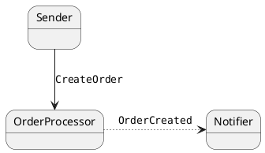

## Components of the system

| Endpoint                             | Notes |
|--------------------------------------|-------|
| `NsbBridgePlayground.Sender`         |       |
| `NsbBridgePlayground.OrderProcessor` |       |
| `NsbBridgePlayground.Notifier`       |       |

## Behavior

Initially, the system does not depend on the bridge.