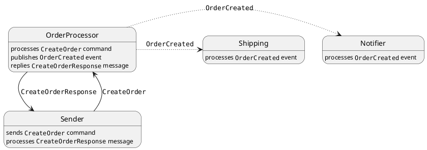
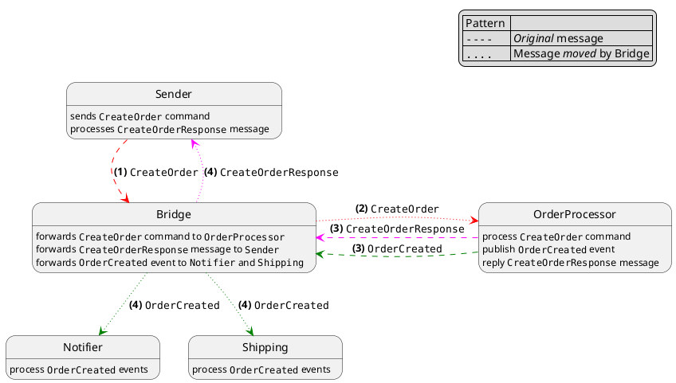

## Components of the system

| Endpoint                             | Notes                                      |
|--------------------------------------|--------------------------------------------|
| `NsbBridgePlayground.Sender`         |                                            |
| `NsbBridgePlayground.OrderProcessor` |                                            |
| `NsbBridgePlayground.Notifier`       |                                            |
| `NsbBridgePlayground.Shipping`       |                                            |
| `NsbBridgePlayground.Bridge`         |                                            |
| `NsbBridgePlayground.Common`         | Messages and infrastructure components     |
| `NsbBridgePlayground.Bootstrap`      | Component to configure and start endpoints |

## Behavior

### Without the bridge

### Using the bridge

## Required Changes

Initially, the system does not depend on the bridge.

- 💥Upgrade to NServiceBus v8

  > We should plan accordingly.
  >
  > This is required for the bridge only, at least initially: transports for v7 and v8 are compatible. 

- A new service, analogous to the router, using `NServiceBus.Transport.Bridge`

- Commands do not need any specific configuration: we can drop any router-dependent settings.

  > This means we have to use plain NServiceBus API, i.e. `RoutingSettings.RouteToEndpoint` for commands.  

- Endpoints need queues for each recipient: for example, in our case, `Sender` is sending commands to `OrderProcessor` so, instead of having a single queue (as it would be with the router), we have a queue for each endpoint the bridge is configured for.  

- For events, it's probably worse for the most part: as far as I can see, the bridge is responsible to send subscriptions explicitly: since endpoints are totally unaware of it, it is up to the bridge to send the service message to the publisher.

> ️📢 When using `NServiceBus.Bridge`, endpoints are unaware of it: endpoints' configuration does not contain any reference to the bridge.
> 
> This is a key difference from the router, when an endpoint must add code to route commands and subscriptions through the router.
> 
> On one hand, this is nice, because it makes endpoints' configuration independent of deployment concerns; on the other hand, it has a serious (IMHO) drawback, because
> 
> - the bridge must be aware of messages relevant to each node
> - the bridge must be redeployed (or reconfigured, if we build some tool) whenever an endpoint subscribes to events published by other endpoints, or sends commands to other endpoints.
>
> We could develop some tool that generates a map of dependencies (there's already a POC for that), and use the result to drive the bridge configuration, for example providing it as a json. 

## TODOs

- Test behavior when one or more servers are offline
 
  Does it implement any circuit-breaker, similar to `NServiceBus.Router`?

## Dockerize

Each project has its `Dockerfile`

> When using Rancher Desktop, I am not able to connect to SQL Server container using the _common_ hostname: I have to use the IP address (in docker subnet). 

## References

- [Migrating from NServiceBus.Router to NServiceBus.Transport.Bridge](https://docs.particular.net/nservicebus/bridge/migrating-from-router)
