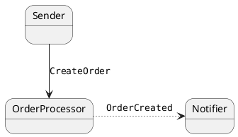

## Components of the system

| Endpoint                             | Notes |
|--------------------------------------|-------|
| `NsbBridgePlayground.Sender`         |       |
| `NsbBridgePlayground.OrderProcessor` |       |
| `NsbBridgePlayground.Notifier`       |       |

## Behavior

Initially, the system does not depend on the bridge.

## Required Changes

- 💥Upgrade to NServiceBus v8

  > We should plan accordingly.

- A new service, analogous to the router, using `NServiceBus.Transport.Bridge`

- Commands do not need any specific configuration: we can drop any router-dependent settings.

  > This means we have to use plain NServiceBus API, i.e. `RoutingSettings.RouteToEndpoint` for commands.  

## References

- [Migrating from NServiceBus.Router to NServiceBus.Transport.Bridge](https://docs.particular.net/nservicebus/bridge/migrating-from-router)
